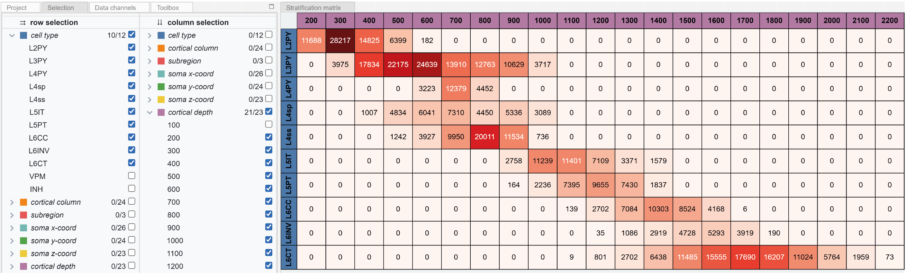

## About
A stratification matrix viewer for analysis of neural network data.

Online version of tool: https://cortexinsilico.zib.de/matrix

Also refer to the [supplementary video](https://cortexinsilico.zib.de/videoShortComplete).

### Cite as
A Stratification Matrix Viewer for Analysis of Neural Network Data.
Philipp Harth, Sumit Kumar Vohra, Daniel Udvary, Marcel Oberlaender, Hans-Christian Hege, Daniel Baum
<i>Eurographics Workshop on Visual Computing for Biology and Medicine (VCBM)</i>, 2022.
https://doi.org/10.2312/vcbm.20221194